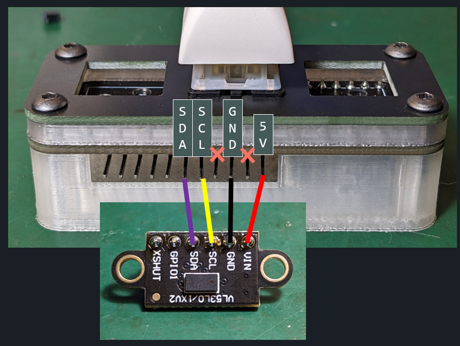
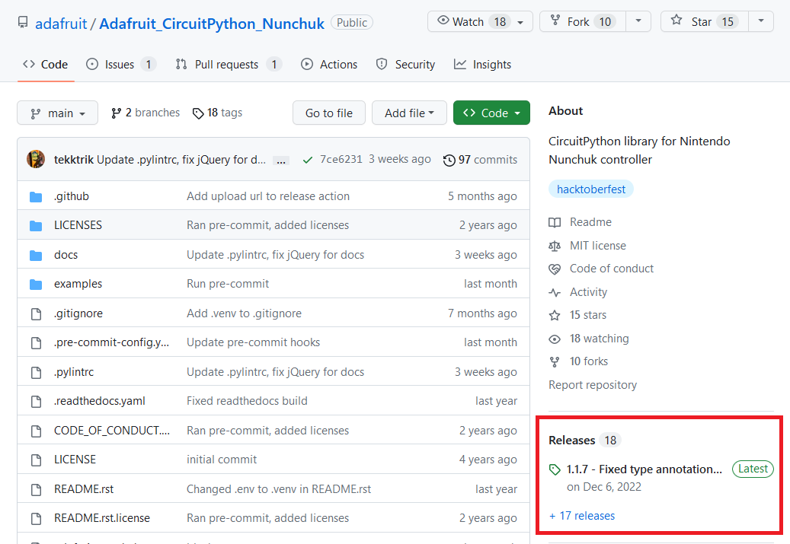

# Ctrl+V a macropad - post-workshop guide

Thanks for coming to our workshop! Hopefully you at least had fun, despite the technical difficulties. Slides are [here](https://sutdapac-my.sharepoint.com/:p:/g/personal/kaien_mui_mymail_sutd_edu_sg/EVwh4K-kNspFuONebHOyrEwB7vdMeQQj_c5V395rlCCQZg?e=si8unr)

If your macropad still isn't working, here's a quick runthrough of the macropad's firmware.

## Flash base firmware (CircuitPython)
The default firmware **flashes the bottom LED through multiple colours**. If your board is doing this, it's not been flashed with any new firmware.

To fix this: 

1. Connect the board to your computer.

2. Hold down the BOOTSEL button (marked **B**) at the bottom of the board, then press the reset button (marked **R**).

    The two buttons on the XIAO microcontroller can be accessed via the two holes at the bottom of the case. Use two pens/allen keys/sticks to press the buttons.

    With the USB port facing up, the BOOTSEL button is the button on the right, and the reset button is the one on the left.

3. The board should reboot into bootloader mode, which mounts a **USB storage device** to your computer named **`RPI-RP2`**. 

4. Copy a .uf2 (which contains firmware) into the newly mounted USB storage device. The board will reboot with the new firmware.

    You can choose to flash [CircuitPython](https://circuitpython.org/board/raspberry_pi_pico/) (download the version for the RPi Pico), or a more mainstream keyboard firmware like QMK (Details on QMK+Vial firmware for this macropad [here](https://github.com/kaine119/oh23-macropad/tree/master/firmware), download [here](https://raw.githubusercontent.com/kaine119/oh23-macropad/master/firmware/kaine119_oh23_macropad_vial.uf2)). 

    If you just want a macropad, QMK is simpler to use (and probably more reliable), and the [Vial](https://get.vial.today) interface lets you configure the keys from a nice GUI. If you go with QMK, you can ignore the rest of this guide.

    However, if you want to play around with the extension header (the extra right-angle pins you soldered that connect to the extra pins on the microcontroller) and connect more electronics to it, I suggest using CircuitPython and KMK.   

    <details>
        <summary>Why not QMK for extra hardware?</summary>
        QMK runs on C at a lower level, and if you're using something not supported by QMK, you'll need to deal with a fair bit of implementation detail and environment setup to get most things running (far more than you would with CircuitPython, anyway). If you've done this before or want to give it a try anyway, <a href="https://github.com/kaine119/vial-qmk/tree/1185f8e67c1cf29fd6341662fbb99d0dc368d78b/keyboards/kaine119/oh23_macropad">here's the my fork of vial-qmk</a>.
    </details>


## Installing KMK on CircuitPython
[KMK](http://kmkfw.io/docs/Getting_Started) is an "application" that runs on top of CircuitPython, providing keyboard functionality. In addition to built-in features that mimic certain QMK features, it comes with an extension system that lets you hook into the keyboard's runtime loop (the scan-process-send loop that the keyboard constantly runs). This allows you to add custom functionality that runs as the keyboard core code is running.  

After flashing CircuitPython, you should have a new USB storage device mounted, called **`CIRCUITPY`**. To get started with KMK, download [this zip file](https://raw.githubusercontent.com/kaine119/oh23-macropad/master/firmware/kmk/circuitpy-contents.zip), unzip it, and copy the **files** within to the `CIRCUITPY` drive. The drive should look like this (i.e. no inner folders containing `code.py`)

```
CIRCUITPY
├─ kmk <folder>
├─ lib <folder>
├─ code.py
├─ my_extension.py
└─ sources.txt
```

(make sure the `kmk` and `lib` folders aren't empty; replace/merge any files/folders if your OS asks)

If it worked, you should be able to start pressing keys. By default, they're bound to left-control, C and V, going from left to right, with the USB port facing the right. 

## Configuring KMK
To rebind the keys, in the `CIRCUITPY` drive, open `code.py`. Towards the end of the file is this section:

```python
# Change your keymap here
# Keycodes can be found on http://kmkfw.io/docs/keycodes
# Left to right, with the USB port facing right
keyboard.keymap = [
    [KC.LCTL, KC.C, KC.V]
]
```

Look at [this page](http://kmkfw.io/docs/keycodes) to get a keycode (for instance, the letter A is `KC.A`), and replace the appropriate entry in `keyboard.keymap`:

```python
keyboard.keymap = [
    [KC.LCTL, KC.A, KC.V]
]
```

(this replaces the C key with an A key.)

There area more keybinds you can achieve with this; see [this section](http://kmkfw.io/docs/Getting_Started#youve-got-another-maybe-diy-board-and-want-to-customize-kmk-for-it) for some examples, and refer to the rest of the [KMK docs](http://kmkfw.io/docs/) for more information.

## Getting the distance sensor to work
Wire up the distance sensor as shown:



Then replace the contents of `my_extension.py` with [this file](https://raw.githubusercontent.com/kaine119/oh23-macropad/d0b4e033a10b72166e941b3d3bad66d64db2654e/firmware/kmk/circuitpy-contents/my_extension.py). 

<details>
<summary>A quick runthrough of what this extension does</summary>

* 
    ```python
    import board
    import neopixel
    from adafruit_fancyled.adafruit_fancyled import CHSV
    import busio
    import math
    import adafruit_vl53l0x
    ```

    This imports the libraries we'll need. `board` and `busio` expose the communication channels on the board itself, `neopixel` and `adafruit_vl53l0x` handle communication with the RGB LED and the distance sensor respectively, and `math` and `adafruit_fancyled.adafruit_fancyled` gives us helper functions we'll use later.   

* 
    ```python
    pixels = neopixel.NeoPixel(board.GP12, 1)
    i2c = busio.I2C(board.GP7, board.GP6)
    sensor = adafruit_vl53l0x.VL53L0X(i2c)
    ```

    This sets up the structures we'll use later. `pixels` represents the RGB LED, `i2c` is the communication channel (specifically [I2C](https://en.wikipedia.org/wiki/I2C)) which the microcontroller uses to talk to `sensor`, the distance sensor.

* 
    ```python
    class MyExtension(Extension):
        def after_hid_send(self, keyboard):
            # some code to read the sensor...

        # ....more event hooks...
    ```
    
    This is the part that gets run during the event loop. KMK defines a `Extension` interface that this class uses, allowing us to provide functions that get run during the various parts of the runtime loop. 

    * `during_bootup`: runs on bootup
    * two of the main tasks in the runtime loop:
        * `before_matrix_scan`, `after_matrix_scan`: runs before and after the microcontroller checks which switches (pins) were held down (set to a particular voltage)
        * `before_hid_send`, `after_hid_send`: runs before and after the keyboard state (which keys are pressed) are sent to the computer
    * extra events that happen outside of the loop:
        * `on_powersave_enable`, `on_powersave_disable`: runs if the board chooses to enter or exit power saving mode
        * `on_runtime_enable`, `on_runtime_disable`: runs when the extension itself is enabled or disabled

    The runtime loop is usually run really tightly (a 1000Hz polling rate means the computer requests the keyboard state 1000 times a second, meaning `after_hid_send` runs about 1000 times a second, too). As such, any code we need to run very frequently can be put under one of these runtime loop functions. At the same time, we only need to use one of them; `after_hid_send` seems like a good choice, as it's after the main thing the keyboard was asked to do (send the keyboard state to the computer).

*
    ```python
    # inside the MyExtension class:
    def after_hid_send(self, keyboard):
        # print(sensor.range)
        brightness = 255 - math.floor(sensor.range / 300 * 255)
        print(brightness)
        colour = CHSV(0, 255, brightness)
        pixels[0] = colour.pack()
        pixels.show()
        return
    ```

    This is the actual task run every loop. We take the range (the distance to whatever is in front of the sensor) that the sensor has read, take a fraction out of 300 (mm), and scale it to 255 (i.e. the final value is between 0 and 255, where further away is bigger). We then subtract this from 255 to get a range of 0-255, where closer is bigger. We'll use this as our brightness value (i.e. closer = brighter). 

    We then build a colour based on this brightness, using HSV (hue, saturation, value/brightness). Try to play around with a [colour picker](https://www.google.com/search?hl=en&q=color%20picker), and watch the HSV value. 

    The colour is then "packed" into regular RGB values, filled into the `pixels` list of colours, and shown. 

    Since this happens at several hundred times a second, and because the sensor values usually change over a relatively longer period of time, the result is a smoothly animated colour, that changes brightness when you move your hand back and forth.
</details>

## Other components
Since KMK is built on CircuitPython, the whole collection of [Adafruit CircuitPython libraries](https://learn.adafruit.com/circuitpython-essentials/circuitpython-libraries) are available, allowing you to interface with a wide variety of hardware, including:
* sensors, measuring distance to an object, acceleration and rotation, brightness, loudness, water pressure, and more
* displays, including LCDs and OLEDs
* motors, including regular DC motors, servo motors and stepper motors (see note below)
* [Wii Nunchucks, apparently](https://github.com/adafruit/Adafruit_CircuitPython_Nunchuk)

See each library's documentation page for more info.

<details>
    <summary>Don't draw too much current from the macropad!</summary>
    Motors typically have draw a lot of current, and being a USB-powered device, the macropad may not be able to supply enough current to the motor. If you're driving a component off the 5V line on the macropad, you'll be limited by the 2A supply typical of USB devices. If you're driving a component off the 3.3V line, you'll be limited by the 500mA current output of the onboard voltage regulator. 
    Drawing too much current may result in damage to your components, or worse, the computer the macropad is connected to. If you need high-power components, consider an offboard power supply / battery.
</details>

<details>
    <summary>A note about downloading Adafruit's CircuitPython libraries</summary>
    Adafruit has a `CircuitPython library bundle` that includes all of their libraries, but it's a bit too fat to fit within the (already generous) flash storage on the microcontroller. Their libraries are also distributed as single `.mpy` files, which can be found on the Releases page of the corresponding GitHub page.
    
</details>